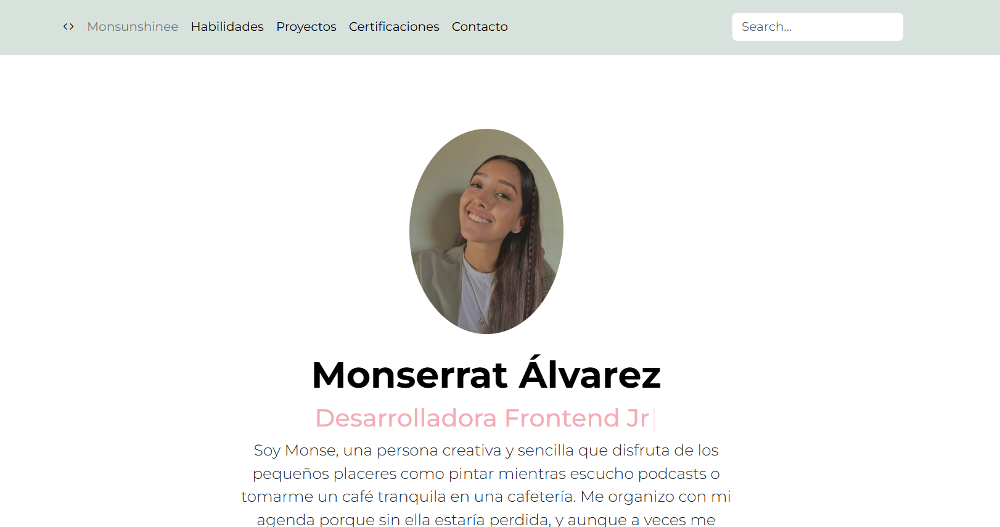
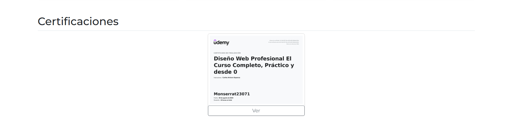

<!-- se usan esos # para colocar titutlos -->
# Portafolio de proyectos
<!-- para agregar negritas se usa ** -->
Hola, soy **Monserrat**, desarolladora web Jr. Aqui encontrarás un poco de mi personalmente e información de mis proyectos.🌸
<!-- Se usan _ para dar espacio con linea  -->
___
## El proyecto cuenta con las secciones de:

- 💪Habilidades
- 📁Proyectos
- 🎖️Certificaciones
- 📩 Contacto 

## Creado con:

- HTML
- CSS
- JavaScript

    
    

### Vista Previa:
  
  
  

  ___

 ### Gracias por explorar este proyecto. Recuerda: cada línea de código cuenta! 😉
*Correo*:
[monserrat23071@gmail.com](mailto:monserrat23071@gmail.com)
___

### Creado en el Bootcamp de Tecnolochicas Pro 💜
[Tecnolochicas](https://tecnolochicas.mx/)